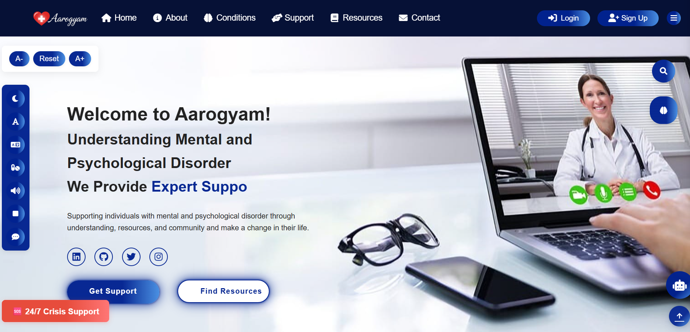

# Aarogyam - Mental and Psychological Support System

A comprehensive web platform dedicated to supporting individuals with mental and psychological disorders through understanding, resources, community support, and accessibility features.

### Homepage

### About

### Mental Health Conditions Section

### Support Services
 
### Accessibility Features

### Authentication System

### AI Search Feature

### Responsive Design

## 🎯 Overview

Core

Mental health information & resources

Professional counseling & community support

Educational library (articles, videos, guides)

Contact forms & newsletter subscription

🤖 AI ChatBot

24/7 intelligent assistant with 50+ local responses

OpenAI fallback for complex queries

Multi-modal interaction (text, speech, visual cues)

Accessibility-first (ARIA labels, keyboard nav, TTS, high contrast)

Session management & error handling

Authentication

Firebase auth (Email, Google, Facebook, GitHub)

Profile management & password recovery

Accessibility Tools

Text-to-speech, reading assistance, focus mode

Adjustable font size, dark mode, dyslexia-friendly font

Navigation aids (breadcrumbs, skip links, progress indicators)

Memory aids (notes, reminders)

Smart Features

AI-powered search

Medication reminders (custom schedules + notifications)

Emergency hotline access

Multi-language support

🗃️ Technical Overview

Frontend: HTML5, CSS3, JavaScript (ES6+), FontAwesome, Boxicons, Typed.js, OpenDyslexic
Backend: Node.js, Express.js, dotenv, OpenAI API
Auth/DB: Firebase Auth & Firestore (users, chat sessions, feedback)
Key Dependencies:

{
  "express": "^4.18.2",
  "openai": "^3.2.1",
  "dotenv": "^16.0.3",
  "nodemon": "^2.0.22"
}

📂 Project Structure
aarogyam/
├── index.html
├── main.js
├── auth.js
├── cognitive-support.js
├── chatbot.js
├── server.js
├── package.json
├── .env
└── README.md

🚀 Setup
npm install
npm run dev   # Development
npm start     # Production

Add your .env:

OPENAI_API_KEY=your_api_key
PORT=3000

🔒 Security & Compliance

Firebase authentication & input validation

Rate limiting & HTTPS ready

WCAG 2.1 AA & Section 508 compliance

📱 Support & Resources

24/7 Crisis: 102 (India), 988 (US)

Emergency button & chatbot help

Contact: ratnsharma21@gmail.com
 | +91-9026678700

9026678700

🤝 Contributing

We welcome improvements in accessibility, features, content, and performance.

👉 Aarogyam is built to make mental health support accessible, inclusive, and always available.